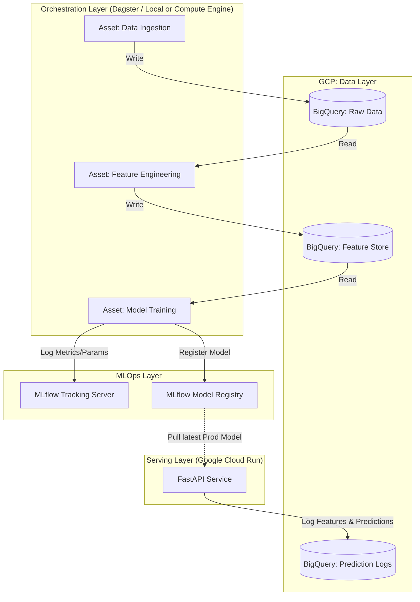

# Architektura Systemu E2E: IEEE-CIS Fraud Detection Platform

> [!WARNING]
> **Korekta Narzędziowa (Bardzo ważne!):** Wymieniłeś w swoim promptcie `EconML`. Zgodnie z naszą wcześniejszą rozmową, **EconML absolutnie NIE NALEŻY do tego projektu**. Wykrywanie oszustw to klasyczny problem *predykcyjny* (klasyfikacja). EconML służy do problemów *przyczynowo-skutkowych* (Causal Inference), czyli to materiał na Twój Projekt nr 2 (Algo Pricing/Uplift). W tym projekcie silnikiem analitycznym będzie **LightGBM / XGBoost**. Reszta stosu (GCP, Dagster, MLflow, Docker) jest idealna.

---

## 1. Scope (Zakres Projektu)
Zbudowanie kompletnego, zautomatyzowanego potoku MLOps dla wykrywania oszustw w płatnościach e-commerce na podstawie danych [IEEE-CIS Fraud Detection](https://www.kaggle.com/c/ieee-fraud-detection). 
System ma obejmować pełny cykl życia modelu: od surowych danych, przez orkiestrację inżynierii cech, trackowanie eksperymentów, aż po wystawienie modelu jako mikroserwisu i monitorowanie jego metryk na produkcji.

**Docelowy odbiorca:** Rekruterzy na stanowiska Lead MLOps Engineer / ML Platform Architect. Projekt krzyczy: *"Umiem wziąć surowy zbiór, zastosować do niego inżynierię oprogramowania i postawić na produkcyjnej chmurze"*.

---

## 2. Architektura i Tech Stack (Google Cloud Platform)

Używamy chmury GCP, co idealnie pozycjonuje Cię jako elastycznego architekta (znasz AWS, teraz pokazujesz GCP).

*   **Data Warehouse (Storage):** Google BigQuery
*   **Orchestration (Data/ML Pipelines):** Dagster
*   **Experiment Tracking & Registry:** MLflow
*   **Model Training:** LightGBM, `scikit-learn`
*   **Model Serving (API):** FastAPI, Uvicorn
*   **Compute/Deployment:** Google Cloud Run (Serverless Containers)
*   **Containerization:** Docker
*   **IaC (Infrastructure as Code):** OpenTofu (Terraform)

---

## 3. Główne Moduły i Przebieg Pracy (Data Flow)

Projekt podzielisz na 4 niezależne moduły (repozytorium w strukturze monorepo).

### Moduł 1: Data Engineering & Feature Store (Dagster + BigQuery)
Zamiast pisać wszystko w jednym Jupyter Notebooku, użyjesz **Dagstera** (Software-Defined Assets).
1.  **Ingestion:** Kod pobierający pliki CSV (IEEE-CIS) i ładujący je do `BigQuery` jako surowe tabele.
2.  **Feature Engineering:** Dagster uruchamia transformacje (możesz użyć zapytań SQL w BQ lub Pandasa). 
    *   *Krytyczne dla Fraud:* Agregacje "Point-in-Time" (np. ile transakcji z tej karty w ciągu ostatnich 24h, średnia kwota itp.). Pamiętaj, aby nie dopuścić do wycieku danych z przyszłości (Data Leakage)!

### Moduł 2: Model Training Pipeline (Dagster + MLflow + LightGBM)
1.  **Data Split:** Pobranie wygenerowanych cech z BQ i podział na zbiór treningowy, walidacyjny i testowy. **UWAGA:** Podział musi być oparty o czas (`TransactionDT`), a nie losowy (w świecie finansów przewidujesz przyszłość na podstawie przeszłości).
2.  **Training:** Wyuczenie modelu **LightGBM**. Użycie parametru `scale_pos_weight` ze względu na to, że fraud to zaledwie ~3.5% danych.
3.  **Kalibracja:** Przekształcenie surowych wyników na rzeczywiste prawdopodobieństwa za pomocą kalibracji (Isotonic Regression lub Platt Scaling).
4.  **Logging:** W trakcie trenowania Dagster komunikuje się z serwerem **MLflow**, logując wszystkie parametry, metrykę PR-AUC (nie ROC-AUC!) oraz plik z gotowym modelem (`.pkl`).

### Moduł 3: Model Serving (FastAPI + Cloud Run)
1.  Mikroserwis napisany w **FastAPI**, zapakowany w **Docker**.
2.  Przy starcie (lub co X minut) mikroserwis odpytuje **MLflow Registry** i pobiera model oznaczony tagiem `Production`.
3.  Wystawia endpoint `POST /predict`, który przyjmuje JSON z parametrami transakcji i zwraca np. `{"fraud_probability": 0.87, "action": "block"}`.
4.  **Monitoring Hook:** Każde żądanie i wynik są asynchronicznie odkładane do tabeli w BigQuery (`BQ_LOGS`), co pozwoli później na analizę dryfu danych.
5.  Wdrożenie kontenera na **Google Cloud Run** pozwala na skalowanie do tysięcy żądań na sekundę i płacenie tylko za czas obliczeń.

### Moduł 4: Infrastructure & CI/CD (OpenTofu + GitHub Actions)
Tutaj uwiarygadniasz swój tytuł *Platform Architect*.
1.  Kod w **OpenTofu** (Terraform), który zakłada datasety w BigQuery, stawia (ewentualnie) serwer MLflow i konfiguruje Cloud Run.
2.  **GitHub Actions:** Pipeline, który uruchamia się przy każdym Pull Requeście: włącza linera (`ruff`), uruchamia testy jednostkowe (`pytest` na funkcje obliczające agregaty czasu), buduje obraz Docker i wdraża go na środowisko testowe w chmurze GCP.

---

## 4. Dziennik Decyzji (Klucz do rozmów technicznych)

Załóż w głównym katalogu plik `DECISIONS.md`. Będziesz tam zapisywał architektoniczne i matematyczne "Dlaczego?". Rekruterzy kochają czytać takie pliki. Przykłady wpisów:

*   *Decyzja:* Użycie Dagstera zamiast Airflow. *Dlaczego:* Asset-based orchestration ułatwia testowanie pipeline'ów lokalnie bez stawiania ciężkiej bazy metadanych.
*   *Decyzja:* Wybór PR-AUC jako głównej metryki optymalizacji. *Dlaczego:* Przy 3.5% fraudu metryka ROC-AUC daje fałszywie optymistyczne wyniki (zbyt duży wpływ True Negatives).
*   *Decyzja:* Czasowy podział zbioru zamiast K-Fold CV. *Dlaczego:* Zapobieganie wyciekowi danych z przyszłości do przeszłości (time-leakage), co symuluje naturalny proces na produkcji.
*   *Decyzja:* Skalowanie aplikacji na Cloud Run. *Dlaczego:* Stateless inference API idealnie wpisuje się w model serverless, drastycznie ograniczając koszty bieżące platformy.

## 5. Szczegółowa Roadmapa Implementacji MLOps (Krok po Kroku)

Aby projekt był zgodny z najlepszymi praktykami MLOps, nie zaczynaj od trenowania modelu. Buduj infrastrukturę wokół pustego modelu, a "prawdziwy" algorytm wstaw na końcu.

